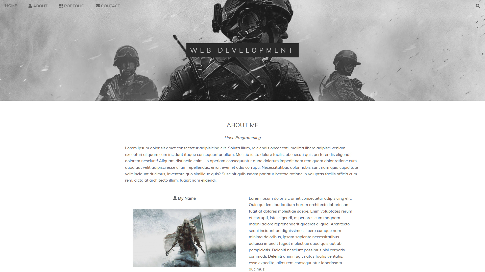

# Static Page With Sass

[Live Demo](https://static-page-with-sass.vercel.app) • One of my first projects and since I like the design I decided to add it to my github. Here my main focus was to create a nice layout for the content using flex-boxes and girds in sass. This project was designed for desktop and large screens.

## Screenshots

